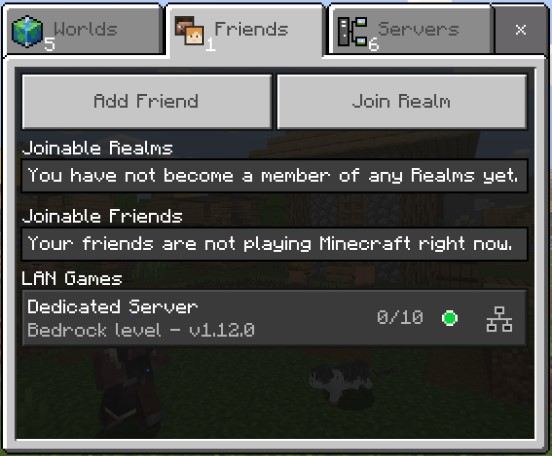

[](https://hub.docker.com/r/itzg/minecraft-bedrock-server/)
[](https://github.com/itzg/docker-minecraft-bedrock-server/issues)
<!-- [](https://github.com/itzg/docker-minecraft-bedrock-server/actions?query=workflow%3ABuild) -->
[](https://discord.gg/ScbTrAw)
[](https://www.buymeacoffee.com/itzg)


[itzg/minecraft-bedrock-server](https://hub.docker.com/r/itzg/minecraft-bedrock-server)

The following starts a Bedrock Dedicated Server running a default version and
exposing the default UDP port: 

```bash
docker run -d -it -e EULA=TRUE -p 19132:19132/udp -v mc-bedrock-data:/data itzg/minecraft-bedrock-server
```

!!! note

    if you plan on running a server for a longer amount of time it is highly recommended using a management layer such as [Docker Compose](bedrock/deployment/docker-compose) or [Kubernetes](bedrock/deployment/k8s) to allow for incremental reconfiguration and image upgrades.

### Upgrading to the latest Bedrock server version

With the `VERSION` variable set to `LATEST`, which is the default, then the Bedrock server can be upgraded by restarting the container. At every startup, the container checks for the latest version and upgrades, if needed.

The latest preview version can be requested by setting `VERSION` to `PREVIEW`.

### Exposed Ports

- UDP 19132 : the Bedrock server port. NOTE that you must append `/udp` when exposing the port, such as `-p 19132:19132/udp`

### Volumes

- `/data` : the location where the downloaded server is expanded and ran. Also contains the configuration properties file `server.properties`

You can create a `named volume` and use it as:

```
docker volume create mc-volume
docker run -d -it --name mc-server -e EULA=TRUE -p 19132:19132/udp -v mc-volume:/data itzg/minecraft-bedrock-server
```

If you're using a named volume and want the bedrock process to run as a non-root user then you will need to pre-create the volume and `chown` it to the desired user.

For example, if you want the bedrock server to run with user ID 1000 and group ID 1000, then create and chown the volume named "bedrock" using:

```
docker run --rm -v bedrock:/data alpine chown 1000:1000 /data
```
If using `docker run` then simply reference that volume "bedrock" in the `-v` argument. If using a compose file, declare the volume as an external using this type of declaration:

``` yaml
volumes:
  bedrock:
    external:
      name: bedrock
```

### Connecting

When running the container on your LAN, you can find and connect to the dedicated server in the "LAN Games" part of the "Friends" tab, such as:



### Permissions

The Bedrock Dedicated Server requires permissions be defined with XUIDs. There are various tools to look these up online and they are also printed to the log when a player joins. There are 3 levels of permissions and 3 options to configure each group

- `OPS` is used to define operators on the server.
  
  ``` shell
  -e OPS "1234567890,0987654321"  
  ```
  
- `MEMBERS` is used to define the members on the server.  

  ``` shell
  -e MEMBERS "1234567890,0987654321"
  ```
  
- `VISITORS` is used to define visitors on the server.  

  ``` shell
  -e VISITORS "1234567890,0987654321"
  ```

### Whitelist

There are two ways to handle a whitelist. The first is to set the `WHITE_LIST` environment variable to true and map in [a whitelist.json](https://minecraft.gamepedia.com/Whitelist.json) that is custom-crafted to the container. The other is to use the `WHITE_LIST_USERS` environment variable to list users that should be whitelisted. This list is player names. The server will look up the names and add in the XUID to match the player.

!!! note

    Starting with `1.16.230.50`, `ALLOW_LIST`, `ALLOW_LIST_USERS`, and the file `allowlist.json` will be used instead.

### Community Solutions

- [kaiede/minecraft-bedrock-backup image](https://hub.docker.com/r/kaiede/minecraft-bedrock-backup) by @Kaiede
- [ghcr.io/edward3h/mc-webhook](https://github.com/edward3h/minecraft-webhook) by @edward3h
- [Minecraft Bedrock Server Bridge](https://github.com/macchie/minecraft-bedrock-server-bridge) by @macchie

### Tutorials
[@TheTinkerDad]([url](https://github.com/TheTinkerDad)) provides an excellent tutorial on how to host multiple instances on a single port (19132) so that it's discoverable: https://www.youtube.com/watch?v=ds0_ESzjbfs
